# clone, build, run (IntelliJ IDEA 2019.1)
IntelliJ IDEA 2019.1 버전을 사용하여 oss에서 리포를 클론한 뒤 빌드, 톰캣 실행까지

# 가이드 환경
- MAC OSX Catalina
- IntelliJ IDEA 2019.1
- [Homebrew](https://brew.sh/index_ko)를 사용한 설치
    - tomcat@8
        - 버전 8.5.50
    - mongoDB
- 본 가이드에서 사용하는 경로
    - MAC OS 계정
        - user
    - passion-fruit 리포 클론 경로
        - `/Users/user/IdeaProjects/passion-fruit`
    - Tomcat 설치 경로
        - `/usr/local/Cellar/tomcat@8/8.5.50/libexec`

# IntelliJ IDEA 2019.1 설치
- 설명
    - 2019.1 버전은 구버전이라 수동으로 설치해야 함
    - 인터페이스나 기능에서 최신버전과는 차이가 있음
    - 다른 버전이 설치되어있어도 다중설치 가능
- 설치 단계
    1. [JetBrains Toolbox App](https://www.jetbrains.com/toolbox-app/) 설치
    1. Toolbox 실행
    1. 업무용 소프트웨어를 구매한 뒤 생성한 JetBrains 계정으로 Toolbox 로그인
    1. IntelliJ IDEA Ultimate 2019.1.4 버전 설치
        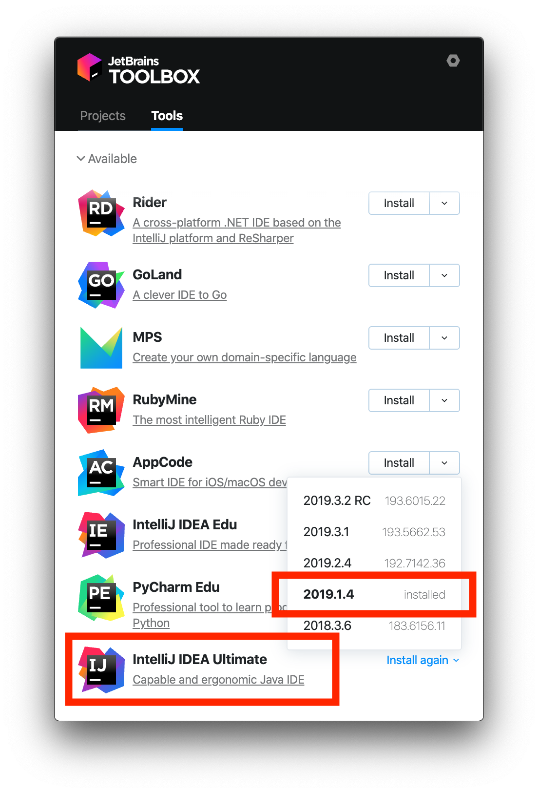

# Tomcat, MongoDB 설치
1. [Homebrew](https://brew.sh/index_ko) 설치
    ```
    $ /usr/bin/ruby -e "$(curl -fsSL https://raw.githubusercontent.com/Homebrew/install/master/install)"
    ```
1. Tomcat 설치
    ```
    $ brew install tomcat@8
    ```
1. Tomcat 테스트
    ```
    $ /usr/local/Cellar/tomcat@8/8.5.50/bin/catalina run
    ```
    - http://127.0.0.1 접속 테스트
    - 종료하려면 터미널에서 `control` + `c`
1. Mongodb 설치 ([가이드](https://zellwk.com/blog/install-mongodb/)))
    ```
    $ brew update
    $ brew tap mongodb/brew
    $ brew install mongodb-community
    $ sudo mkdir -p /System/Volumes/Data/data/db
    $ sudo chown -R `id -un` /System/Volumes/Data/data/db
    $ brew services start mongodb-community
    ```
1. Mongodb 테스트 ([가이드](https://velopert.com/457))
    ```
    $ mongo
    MongoDB shell version v4.2.2
    ...
    
    > use test;
    switched to db test
    
    > db.book.insert({"name": "MongoDB Tutorial", "author": "velopert"});
    WriteResult({ "nInserted" : 1 })
    
    > show dbs;
    ...
    ```

# 리포 클론
1. IntelliJ IDEA 2019.1 실행
1. ***`Check out from Version Vontrol`*** > ***`Git`***
    1. URL : https://oss.navercorp.com/shopping/passion-fruit.git
    1. Directory : /Users/user/IdeaProjects/passion-fruit
1. ***`clone`*** 클릭
1. /Users/user/IdeaProjects/passion-fruit/build.gradle 파일을 열 것이냐고 물어보면 ***`Yes`*** 클릭
1. 아래와 같이 Import From Gradle 설정 후 ***`OK`*** 클릭
    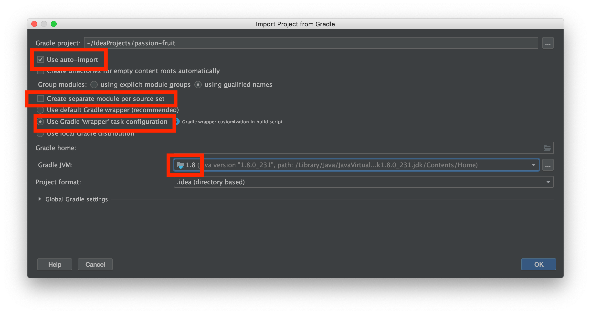
1. sync 가 완료될 때까지 대기
    1. sync 완료되면 우측 gradle 탭이 아래와 같이 구성됨
        

# 빌드
1. release 브랜치 체크아웃
    1. ***`VCS`*** > ***`Git`*** > ***`Branches...`***
        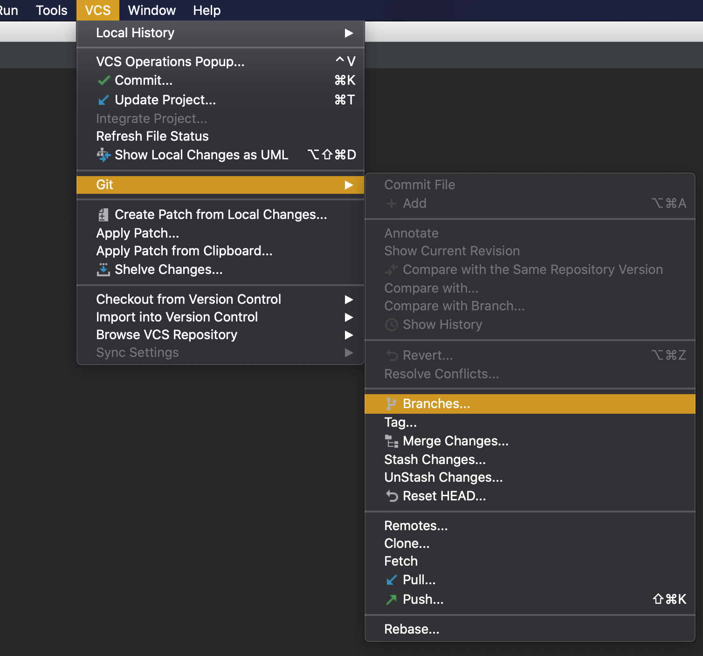
    1. ***`origin/release`*** 선택
        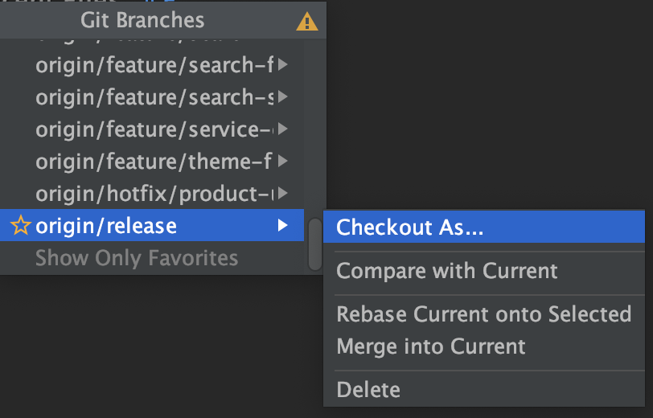
        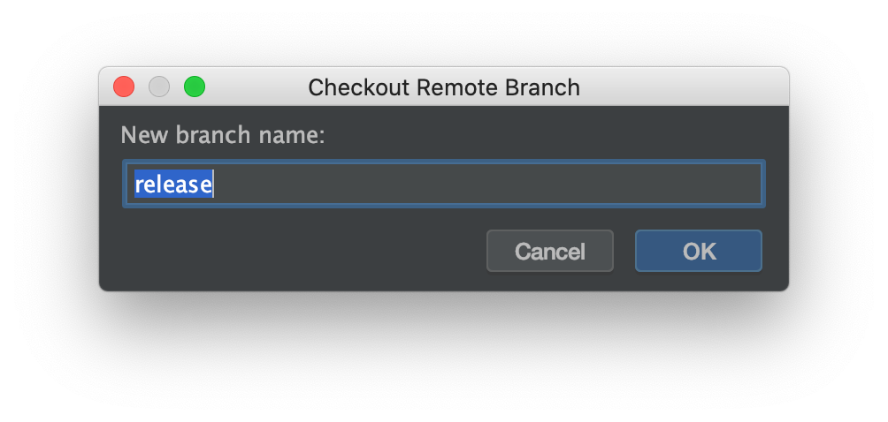
1. Lombok 플러그인 설치
    1. ***`IntelliJ IDEA`*** > ***`Preferences`*** > ***`Plugins`***
        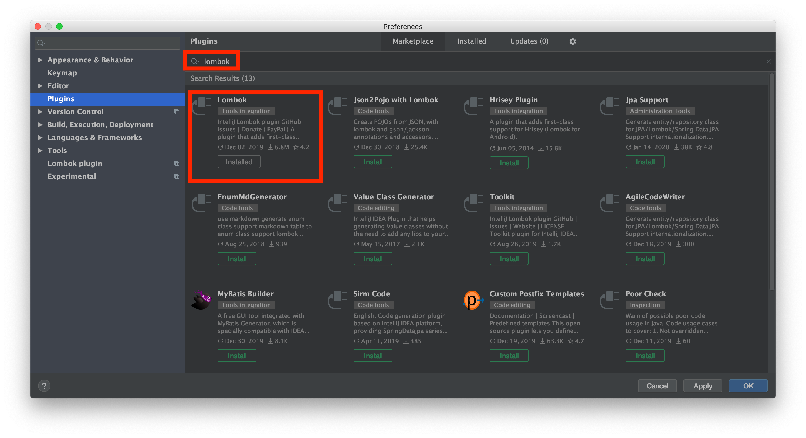
1. ***`Enable annotation processing`***
    1. ***`IntelliJ IDEA`*** > ***`Preferences`*** 
    1. ***`Build, Execution, Deployment`*** > ***`Compiler`*** > ***`Annotation Processors`***
    1. ***`Enable annotation processing`*** 체크
        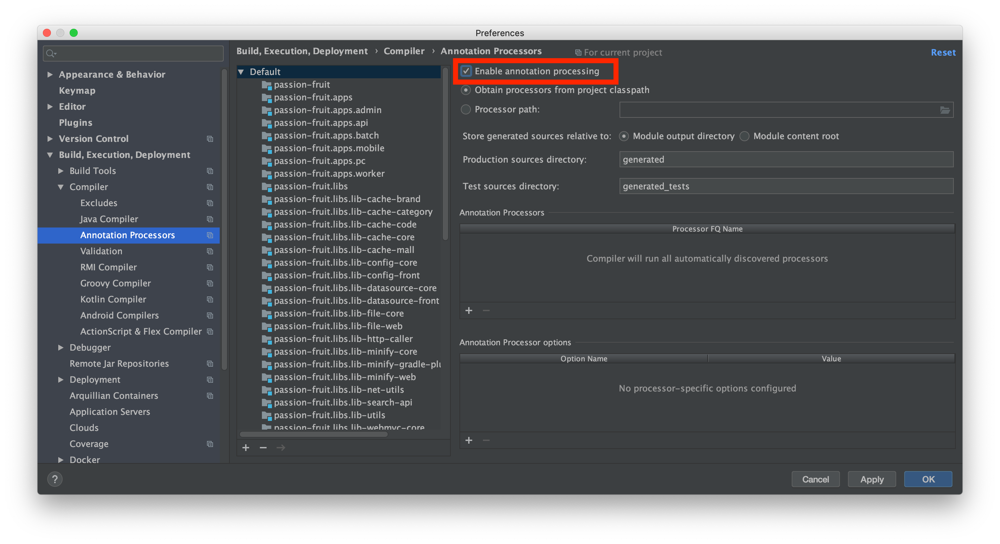
1. Build Project
    1. 빌드에 실패한다면 옆사람에게 문의

# IntelliJ 에서 Tomcat 실행 Configuration 생성
1. ***`Run`*** > ***`Edit Configurations...`*** 클릭
1. 왼쪽 상단의 ***`+`*** 클릭 후 ***`Tomcat Server`*** > ***`Local`*** 클릭
    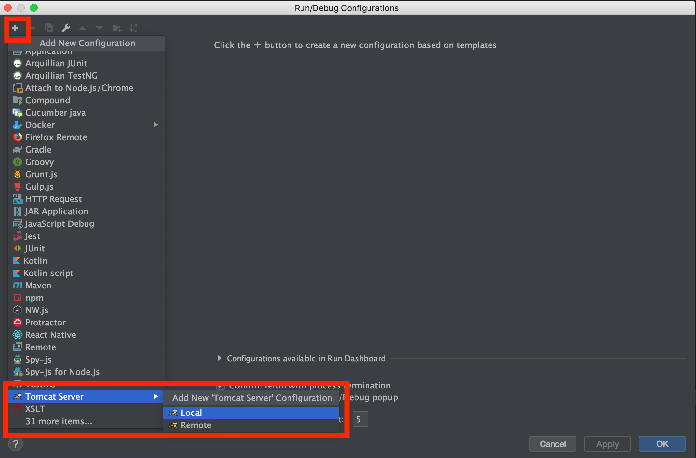
1. ***`Name`*** 지정 후 ***`Configuration`*** 클릭
    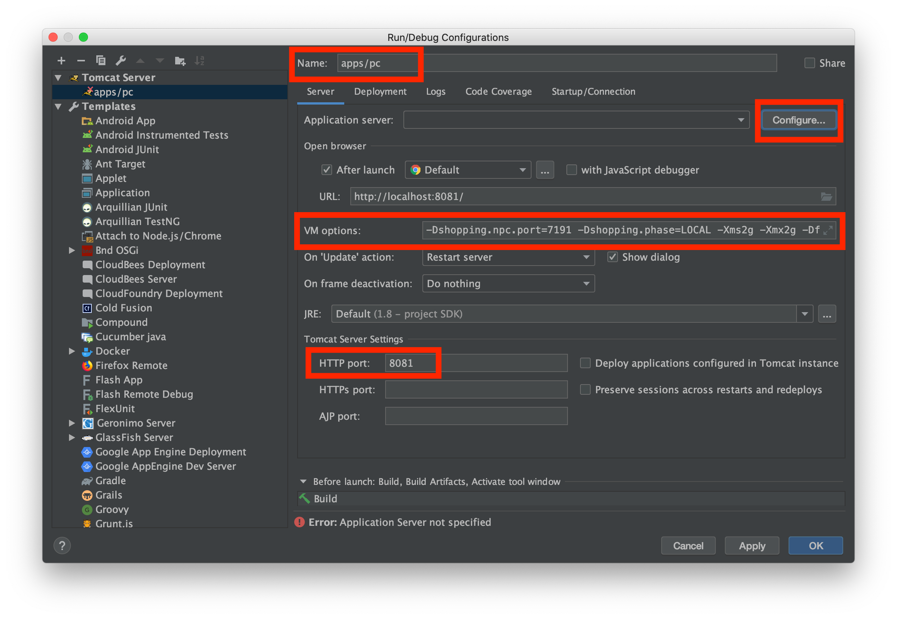
1. Tomcat Home 경로에 `/usr/local/Cellar/tomcat@8/8.5.50/libexec` 입력
    
1. ***`VM Options`*** 에 다음과 같이 입력
    ```
    -Dshopping.npc.port=7191 -Dshopping.phase=LOCAL -Xms2g -Xmx2g -Dfile.encoding=UTF-8 -Duser.language=ko -Duser.country=KR
    ```
    - 입력 내용 중 `Dshopping.npc.port` 는 실행하려는 app에 따라 다르게 입력
        - pc : 7191
        - mobile : 7192
        - api : 7193
        - admin : 7194
        - worker : 7195
1. ***`HTTP port`*** 를 원하는 번호로 지정
1. ***`Deployment`*** 탭으로 이동 후 하단의 ***`+`*** 클릭 ***`Artifact`*** 클릭
    
1. 원하는 app을 exploded 로 선택
    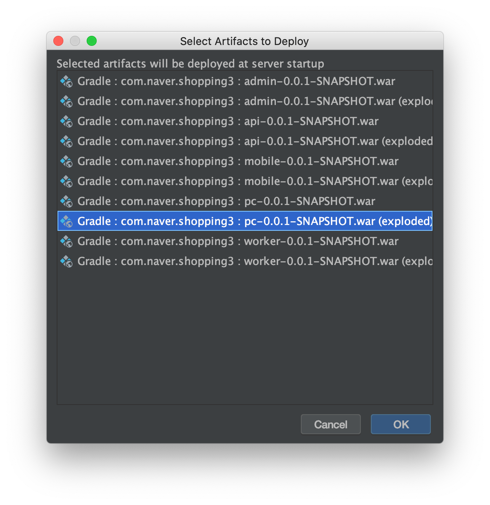
1.***`Application Context`*** 를 ***`/`*** 로 지정
    
1. ***`OK`*** 클릭하여 서버 생성

# 실행
1. 서버 실행
    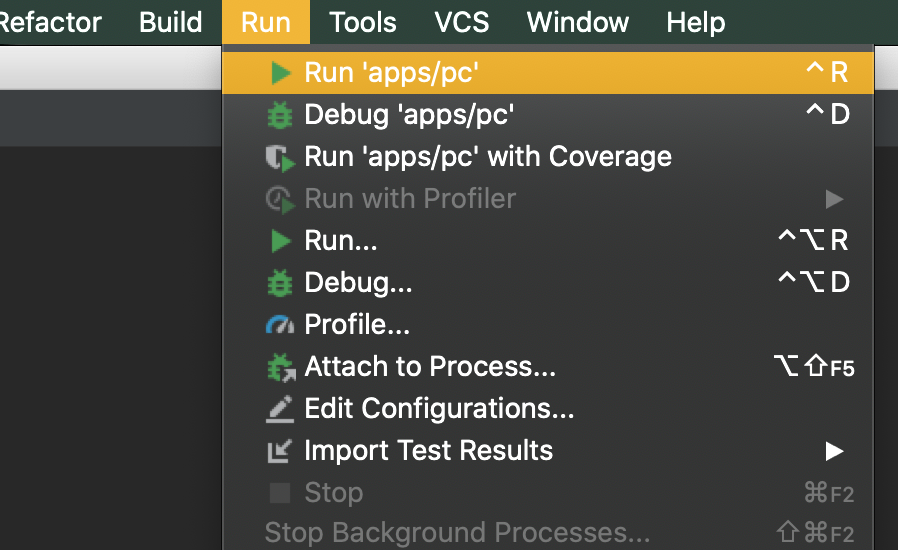
1. 자동으로 다시 빌드한 뒤 Tomcat 이 정상 실행되면 기본 브라우저로 http://127.0.0.1:8081 이 뜬다. (port번호는 지정한대로)
1. "이 메시지는 운영환경에서는 보이지 않습니다. 검색페이지로 이동합니다." 메시지 후에 화면이 나온다.
    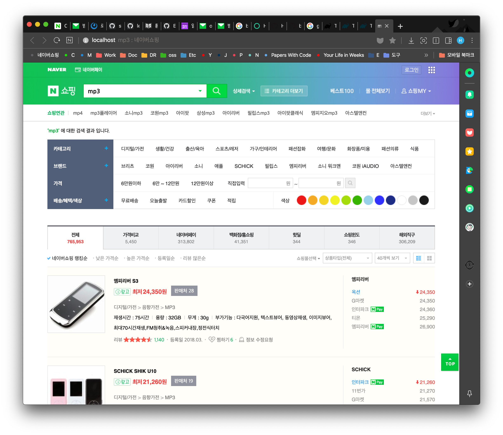
1. 이후 app 별로 여러 개의 Tomcat 서버를 설정하고 사용하면 편하다. ([IntelliJ 에서 Tomcat 실행 Configuration 생성](#IntelliJ 에서 Tomcat 실행 Configuration 생성) 전체 과정 반복)
1. 각 app별 테스트 예시 URL
    - pc : http://localhost:8081/search/all.nhn?query=mp3
    - mobile :
    - api : http://localhost:8083/barcode/barcode.nhn?barcode=8802070708389
    - admin : http://localhost:8084/recommendcomponent/keyword.nhn
    - worker : 
